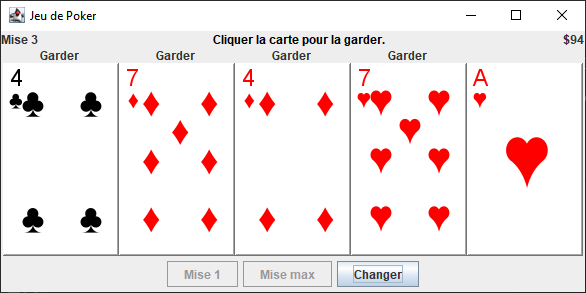

# Video Poker

[](https://github.com/yourusername/VideoPoker/actions/workflows/maven-test.yml)

A classic Video Poker game implementation in Java. This project was originally created around 2004 and has been updated to use modern build tools.



## Features

- Standard Video Poker gameplay with betting and card exchange
- Multiple winning hand combinations
- Internationalization support (English and French -- not working)
- Classic card graphics

## Building and Running

### Prerequisites

- Java 11 or higher
- Maven

### Build Instructions

```bash
# Clone the repository
git clone https://github.com/yourusername/VideoPoker.git
cd VideoPoker

# Build the project
mvn clean package

# Run the game (French)
java -jar target/video-poker-1.0-SNAPSHOT.jar
```

### Testing

Run the tests using Maven:

```bash
mvn test
```

## License
This project is licensed under the MIT License. See the [LICENSE](LICENSE) file for details.


